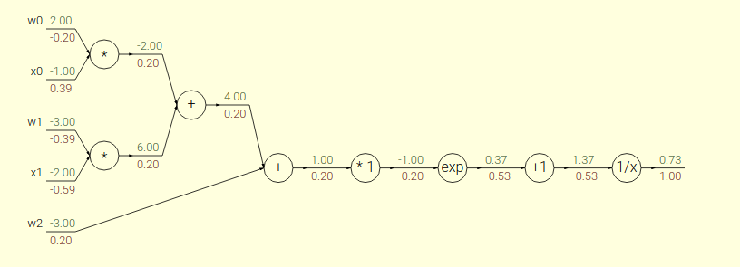

#### Softmax Loss和Multiclass SVM Loss

##### Softmax Loss

$$
L_i = -\log\left(\frac{e^{S_{y_i}}}{ \sum_j e^{S_j} }\right) \hspace{0.5in} \text y_i就是我们是正确的样本对应的标签值
$$

##### SVM Loss

$$
L_i = \sum_{j\neq y_i} \max(0, s_j - s_{y_i} + \Delta)   \hspace{0.5in}  \text  {Delta}代表margin， 上图中取得是1.
$$

Softmax在计算误差的时候考虑到了所有的类别的取值，如果希望softmax loss尽可能的小，会导致其他类别的分数尽可能的低；在SVM Loss中，它只考虑了那些在正确值附近的（比如1）或者大幅度压制了正确的分类的那些值。SVM Loss 激励着正确的类别比其他类有着超过margin的得分，SVM Loss 不关心每个独立类别的得分，softmax loss把得分解释成为了概率分布。比如（10， -1， -1）和（10， 9， 9）在margin为1的分类中，SVM loss都是0，而softloss就会有很大的区别。个人偏向于softmax的可解释性。

#### 激活函数

##### Sigmoid函数

$$
f(z) = \frac{1}{1 + e^{-z}}
$$

优点：能够吧输入的连续实数值变换到0~1之间。

缺点：

1. 在神经网络的反向传播的时候特别容易发生梯度消失。（他的导数值（0, 0.25）在两边都趋近于0）
2. 不是0中心，会导致梯度更新只会往一个方向更新。梯度大于0，则往正，小于0，往负。导致收敛变慢。
3. 幂运算，耗时。

##### tanh函数

$$
tanh(x) = \frac {e^x - e^{-x}}{e^x + e^{-x}}
$$

优点：解决了Sigmoid的不是零中心的问题，并且在中部的梯度更大，梯度区间（0,1）

缺点：梯度消失还是没有解决，仍然有幂运算。

##### Relu函数

$$
relu(x) = max(0, x)
$$

优点：

1. 在正区间解决了梯度消失的问题，因为正区间的梯度都是1.
2. 计算速度快
3. 收敛速度快，因为在正区间的梯度都是1。

缺点：

1. relu的输出不是0中心的
2. 会有deadrelu的出现，因为在负半轴的梯度都是0.

##### 其他函数

leaky relu , maxout等

#### 正则化

参数越少(参数稀疏），参数越小，模型越不容易过拟合。

1）实现参数的稀疏有什么好处吗？

一个好处是可以简化模型，避免过拟合。因为一个模型中真正重要的参数可能并不多，如果考虑所有的参数起作用，那么可以对训练数据可以预测的很好，但是对测试数据就只能呵呵了。另一个好处是参数变少可以使整个模型获得更好的可解释性。

2）参数值越小代表模型越简单吗？

是的。为什么参数越小，说明模型越简单呢，这是因为越复杂的模型，越是会尝试对所有的样本进行拟合，甚至包括一些异常样本点，这就容易造成在较小的区间里预测值产生较大的波动，这种较大的波动也反映了在这个区间里的导数很大，而只有较大的参数值才能产生较大的导数。因此复杂的模型，其参数值会比较大。

https://www.cnblogs.com/weizc/p/5778678.html

https://www.jianshu.com/p/475d2c3197d2

##### L0, L1, L2范数

L0是统计这个向量当中非零元素的个数，L1是每个元素的绝对值之和，L2是每个元素的平方之和再求平方根。

其中L0和L1可以实现参数稀疏，因为他们都可以让参数变成0，L2又叫岭回归（Ridge Regression）或者权值衰减（Weight Decay)

L1 比 L0好是因为L0不容易求解。L1会趋向于产生少量的特征，L2会选择更多的特征，L1在特征选择的时候有用，L2只是一种规则化。

#### optimiaer优化器

https://blog.csdn.net/huplion/article/details/79184338

1. SGD

   x += leraning_rate * dx

   缺点：容易陷入局部极值点中。

2. Momentum 增加动量

   v = momentum * v - learning_rate * dx

   x += v

3. Adgrad 让他们在不同方向的特征的进行缩放，使他们有相近似的尺度

   cache += dx**2

   x += -learning_rate * dx / np.sqrt(cache)

4. RMSProp 

   adgrad随着时间的推移会导致，cache变大，导致学习率降低。

   cache = decay_rate * cache + (1 - decay_rate) * dx**2

   x += - learning_rate * dx / np.sqrt(cache)

5. Adam

   Adam 是Adgrad 和 Momentum的合体

   m = beta1 * m + (1 - beta1) *dx

   v = beta2 * v + (1 - beta2) * dx**2

   m /= 1 - beta1**t

   v /= 1 - beta2**t

   x += -learning_rate * m / np.sqrt(v)

6. 牛顿法

   计算海森矩阵所需要的计算量过大。

##### BP算法推导

1. add gate 平均分配上流梯度
2. mutiply gate 交换相乘
3. max gate 送到大的一方

##### DropOut

随机使某些神经元失活。

起作用的原因：

1. 降低节点之间的依赖性，降低结构风险，使模型的泛化能力加强。
2. 类似于多模型投票一样，平衡神经元之间的重要性。不会出现高权重节点完全控制输出的情况。

##### 防止Softmax函数的上溢和下溢

https://blog.csdn.net/m0_37477175/article/details/79686164

1. 在softmax时，同时除以e^{S_max}
2. 在log softmax时也同事除以e^max次方

##### BN

https://www.cnblogs.com/guoyaohua/p/8724433.html

解决的问题：均值偏移

解决方法：

1. 训练：
   $$
   \hat x^{k} = \frac {x^{(k)} - E[x^{(k)}]} {\sqrt {Var[x^{(k)}]}}
   $$

   $$
   y^{(k)} = \gamma^{(k)}\hat x^{k} + \beta^{(k)}
   $$

2. 测试：第一步的方差和期望都是全局方差和期望，第二部的gamma和beta都是训练好了的。

优点：1.提升训练速度，2.增加分类效果，3.初始化要求降低。

#### 全局平均池化层

GAP相对于FC的优势：

1. 参数更少
2. 因为参数少减少了过拟合