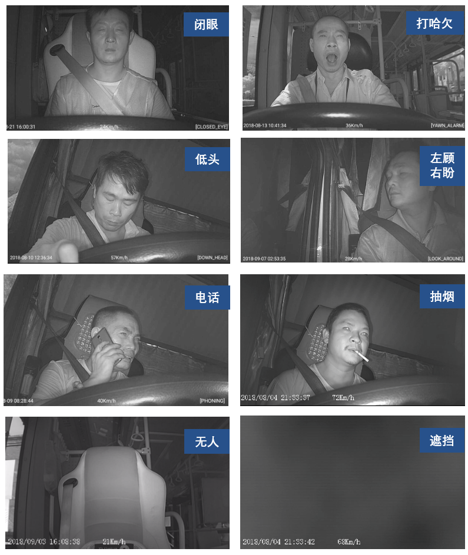
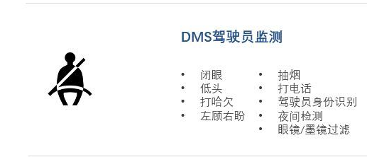

# 有关驾驶员行为监测系统文章

##### [驾驶员疲劳监测技术已经较为成熟且应用在量产车型上，而且驾驶员状态识别是自动驾驶L4、L5所必需的技术](http://www.cnautonews.com/jrtt/201710/t20171021_559780.htm)

##### [这是极目科技做的一种驾驶员监测系统](http://www.elecfans.com/d/760959.html)

1. 对于驾驶辅助系统，做好对驾驶员的注意力监控是十分必要的，因为人类很容易过度信任系统的驾驶能力，反而增大了潜在的事故风险概率。
2. 从2020年开始，想要获得欧盟五星安全认证的车辆就必须具备驾驶员监测功能
3. 一种是通过确保驾驶员的手在方向盘上，另一种是确保驾驶员的视线在前方道路上
4. 目前国内外的驾驶员监测技术其实处于比较初级的阶段
5. 人类很容易过度信任系统的驾驶能力，反而增大了潜在的事故风险概率
6. 系统需要能够判断出司机的真实意图，让系统与驾驶员之间能够通过多次交互建立信任感
7. 夜间、逆光等高挑战性光照环境下也能提供高品质的成像质量
8. 识别准确率是驾驶员监测系统最核心的指标之一

##### [疲劳监测技术发展趋势（PPT）](https://wenku.baidu.com/view/b03ce98b02020740be1e9bac.html)

##### [交通运输不关于驾驶员监测技术（DMS）推广政策](http://www.sohu.com/a/253902183_385219)

1. 智能视频监控报警装置的功能要求主要有**驾驶员行为监测**、**车辆运行监测**

2. 检测的动作有：闭眼、打哈欠、低头等

   

