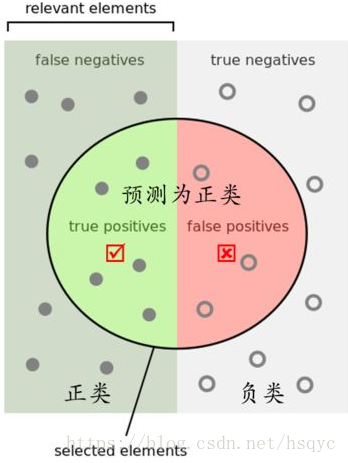
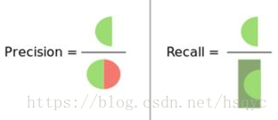
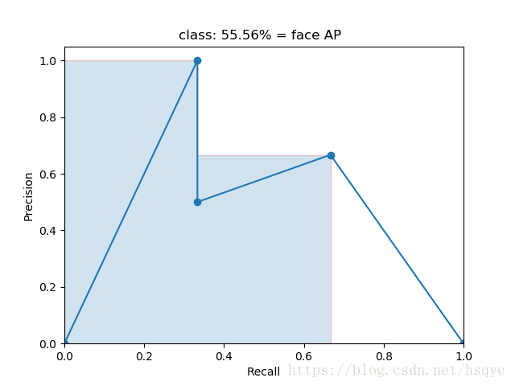

##### [理解目标检测当中的mAP](https://blog.csdn.net/hsqyc/article/details/81702437)

1. 精度precision：分类器正确分类的前景数量除以分类器所认为的所有前景数量
   $$
   Precision = \frac {TP}{TP + FP}
   $$
   

   召回率Recall：分类器正确分类的前景数量除以所有的前景数量（GroundTruth)
   $$
   Recall = \frac {TP} {TP + FN}
   $$

2. AP

   根据不同的IOU阈值得到不同的precision 和 recall所绘制出的图像的下方的面积（向左端对齐）